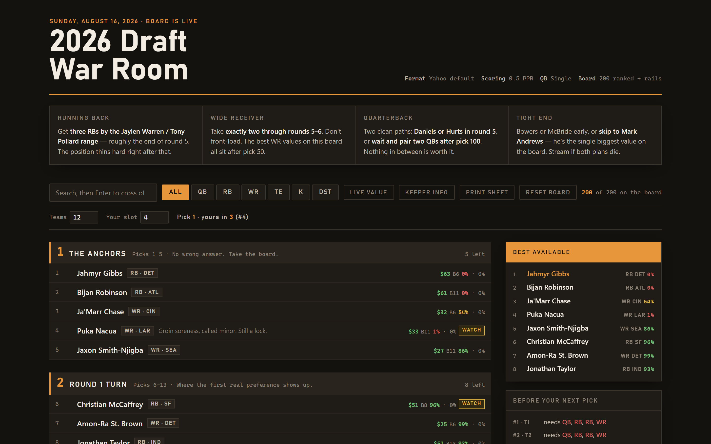
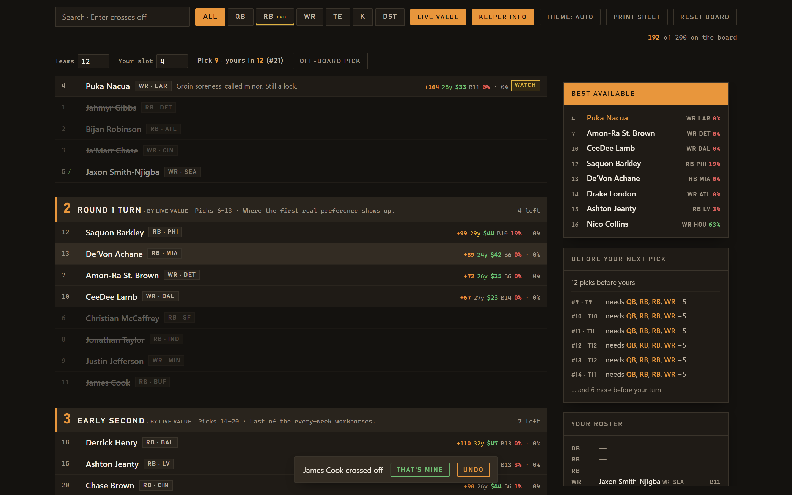

# FantasyLeagueFootball

[](CHANGELOG.md)
[](LICENSE)
[](pyproject.toml)
[](#install)
[](tests/)
[](pyproject.toml)

A draft-day board for **Yahoo half-PPR fantasy football**. Renders one self-contained HTML page you keep open on a second screen while you draft — click players off as they go, watch tiers drain, and get warned the moment a tier is about to break.

Ships with a ranked 2026 board (75 players, 7 tiers) plus value/reach flags, a do-not-draft list, a training-camp injury board, and late-round targets. Zero runtime dependencies. No account, no network calls, no telemetry — the page works from `file://` with the Wi-Fi off.



## Why this exists

Rankings sites give you a list. A list doesn't answer the only question that matters at the turn: *take him now, or gamble he lasts eleven picks?* Players inside a tier are close enough to be interchangeable; the value cliff is **between** tiers. So this board tracks how many players each tier has left and flags **Tier break** when one is down to its last two — that's your cue to reach instead of waiting for the wheel.



## Features

- **One file, works offline.** `fantasyleague build` writes `dist/draft-board.html` (~37 KB) with all CSS/JS inlined and the dataset embedded. Open it anywhere.
- **Click to cross off.** Every row is a button. State is saved in the browser, so a refresh mid-draft doesn't lose your place. Reset with one click.
- **Tier-break warnings.** Each tier header shows how many are left and lights up at two.
- **Best available** updates as you go, overall or filtered to one position.
- **Position filters + name search** so you can answer "best RB left?" in one tap.
- **Value / Reach / Watch flags** on rows — Yahoo ADP versus Yahoo's own projected finish, plus active injury notes.
- **Rails:** positional plan for the draft, do-not-draft list with reasons, injury board with severity, late-round targets.
- **Dark-first, light-aware.** Follows `prefers-color-scheme` and honors an explicit `data-theme` toggle. Reduced-motion respected. Focus states and `aria-pressed` on every control.
- **Terminal CLI** over the same data: `list`, `values`, `next --drafted …` for best available and tier breaks without a browser.
- **Bring your own board.** Any JSON matching the packaged file works; it's validated on load so a bad edit fails loudly instead of rendering holes.

## Install

Python 3.11 or newer. No other requirements.

```bash
# from GitHub
pip install git+https://github.com/SysAdminDoc/FantasyLeagueFootball

# or from a clone
git clone https://github.com/SysAdminDoc/FantasyLeagueFootball
cd FantasyLeagueFootball
pip install -e .
```

Prefer not to install? Grab `draft-board.html` from the [latest release](https://github.com/SysAdminDoc/FantasyLeagueFootball/releases) and just open it.

## Quick start

```bash
fantasyleague build --open        # writes dist/draft-board.html and opens it
```

Then during the draft: click players as they're taken; switch the position chips to see best available at RB/WR/QB/TE; when a tier header shows **Tier break**, decide now.

If `fantasyleague` isn't on your PATH (common on Windows), `python -m fantasyleague …` does the same thing.

## CLI reference

| Command | What it does |
|---|---|
| `fantasyleague build [-o PATH] [--title T] [--league NAME] [--open]` | Render the board. Default output `dist/draft-board.html`. `--league` shows the name in the header and keeps that board's saved picks separate from other boards in the same browser. |
| `fantasyleague list [--pos QB\|RB\|WR\|TE\|ALL] [--flag value\|avoid\|watch] [--limit N]` | The board as a table. |
| `fantasyleague values` | Value picks, reaches, and the do-not-draft list. |
| `fantasyleague next [--drafted RANK …] [--pos …] [--limit N]` | Best available given who's gone, plus any tier down to its last two and a remaining-by-position count. |
| `fantasyleague --data my.json <command>` | Run any command against your own dataset. |
| `fantasyleague --version` | Version string. |

Examples:

```bash
fantasyleague list --pos RB
fantasyleague list --flag value
fantasyleague next --drafted 1 2 3 5 8 --pos WR --limit 5
fantasyleague --data my-league.json build -o dist/my-board.html --league "Thursday League"
```

## The 2026 board

**Format assumptions:** Yahoo defaults — half-PPR, single QB. Ranks 1–75 follow the Rotoworld/NBC Sports top-200 consensus; flags compare Yahoo ADP against Yahoo's projected finish; the injury board is compiled from Yahoo's training-camp report. Data is current through **August 16, 2026**. Fantasy data goes stale fast — recheck the injury board before you draft.

### Tiers

| # | Tier | Picks | Read it as |
|---|---|---|---|
| 1 | The anchors | 1–5 | No wrong answer. Take the board. |
| 2 | Round 1 turn | 6–13 | Where the first real preference shows up. |
| 3 | Early second | 14–20 | Last of the every-week workhorses. |
| 4 | RB / WR crossroads | 21–30 | Your roster shape gets decided here. |
| 5 | Rounds 3–4 | 31–42 | Elite QBs enter. So do the first traps. |
| 6 | Rounds 4–5 | 43–56 | Third RB deadline. Don't drift past it. |
| 7 | Rounds 5–7 | 57–75 | The value pocket. Most of your edge is here. |

### Flags

| Flag | Meaning |
|---|---|
| **Value** | Yahoo ADP is later than the projected finish — buy. |
| **Reach** | ADP is earlier than the projection — let someone else pay that price. |
| **Watch** | Draftable, but carrying an active injury note. |

### The plan the board is built around

- **RB:** three by the Jaylen Warren / Tony Pollard range (~end of round 5). The position thins hard after that.
- **WR:** exactly two through rounds 5–6; the best WR values sit after pick 50.
- **QB:** Daniels or Hurts in round 5, or wait and pair two after pick 100. Nothing between.
- **TE:** Bowers or McBride early, or skip to Mark Andrews — ADP 115, projects 78th, the biggest gap on the board.

## Custom data

Point any command at your own file:

```bash
fantasyleague --data my-league.json build
```

The shape is [`players_2026.json`](src/fantasyleague/data/players_2026.json). The pieces:

```jsonc
{
  "season": 2026, "scoring": "half_ppr", "format": "…", "updated": "2026-08-16",
  "tiers":   [{ "n": 1, "name": "The anchors", "range": "Picks 1–5", "note": "…" }],
  "players": [{ "rank": 1, "name": "Jahmyr Gibbs", "pos": "RB", "team": "DET",
                "tier": 1, "flag": null, "note": "" }],
  "plan":         [{ "position": "Running back", "guidance": "…" }],
  "do_not_draft": [{ "name": "…", "pos": "QB", "team": "LAC", "why": "…" }],
  "injuries":     [{ "name": "…", "team": "SF", "severity": "out|risk|ok", "status": "line one|line two" }],
  "sleepers":     [{ "name": "…", "pos": "TE", "team": "BAL", "why": "…" }],
  "sources":      [{ "label": "…", "url": "https://…" }]
}
```

`guidance` text may use `**bold**` for emphasis; it is escaped before rendering, so HTML in any field shows up as literal text rather than markup.

Validation on load rejects: ranks that aren't exactly `1..N` (gaps or duplicates), duplicate player names, a `tier` that isn't defined in `tiers`, a `pos` outside `QB/RB/WR/TE`, a `flag` outside `value/avoid/watch`, a `severity` outside `out/risk/ok`. Bad data fails at load with a message naming the problem — never a board with holes in it.

## Theming

Dark is the default. The page defines a complete light palette too and picks one three ways: the OS setting via `prefers-color-scheme`, or an explicit `data-theme="dark"|"light"` on `<html>` if a host page sets one. Every color is a token; nothing is defined only inside a media query, so neither theme can end up with the other theme's text.

## Development

```bash
pip install -e ".[dev]"
python -m playwright install chromium   # only needed for the browser tests
pytest                                  # 42 tests
ruff check .
python -m build                         # wheel + sdist into dist/
```

What the tests cover:

- **Dataset integrity** — contiguous ranks, unique names, no orphan tiers, known positions/flags/severities; the validation errors themselves.
- **Draft-time queries** — best available skips drafted players and respects position; tier breaks fire at the threshold and ignore empty tiers.
- **Render** — output is a complete document, fully inlined, no external requests, both themes defined, no leftover template tokens, `</script>` in the data can't break the page, version stamped.
- **DOM contract** — every element ID `board.js` queries exists in the template; every flag has a label; every severity has a style; the tier-break threshold matches between Python and JS.
- **Real browser** (Playwright, skipped if unavailable) — 75 rows render with zero JS errors, click toggles `aria-pressed` and updates best available, tier break appears at two left, state survives a reload, position filter and reset work, light theme paints its own background.

Project layout:

```
src/fantasyleague/
  data/players_2026.json     the board — single source of truth
  models.py                  frozen dataclasses, validated on construction
  board.py                   load / validate / draft-time queries
  render.py                  token replacement into the HTML template
  cli.py                     argparse front end
  assets/board.{html.template,css,js}
tests/                       42 tests across data, queries, render, DOM contract, browser
docs/                        README screenshots
```

## Roadmap

[ROADMAP.md](ROADMAP.md) is the single task tracker. Headline items: snake-draft awareness (your next pick + odds a player survives to it), a local `serve` mode with live sync from Sleeper's public API and Yahoo's OAuth draft results, K/DST and bye weeks, roster tracking, a print stylesheet, and four P0 fixes queued from the 2026-08-16 research pass.

## Known limitations (v0.0.1)

- Board is 75 deep — runs out around round 7 in a 12-team league; the sleeper rail carries the late rounds.
- No K or DEF positions yet; no bye weeks; no roster tracking; no live sync.

## License

MIT — see [LICENSE](LICENSE).
