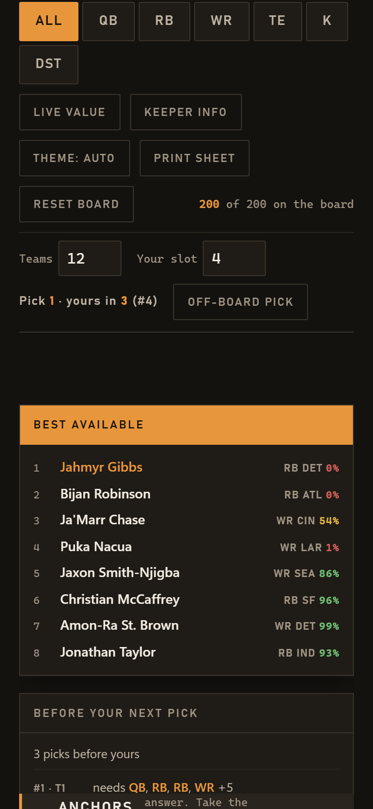

# FantasyLeagueFootball

[](CHANGELOG.md)
[](LICENSE)
[](pyproject.toml)
[](#install)
[](tests/)
[](pyproject.toml)

A draft-day board — and, once the season starts, a manager — for **Yahoo fantasy football**. On draft night it renders one self-contained HTML page you keep open on a second screen: click players off as they go, watch tiers drain, and get warned the moment a tier is about to break. Afterwards it reads every roster in your league and answers the three in-season questions: who do I start, who do I add, is this trade good for me.

Ships with a ranked 2026 board — 200 players in 12 tiers — with value/reach flags, a do-not-draft list, a training-camp injury board, and late-round targets. Zero runtime dependencies, no account, no telemetry. The rendered page makes no network calls at all — it works from `file://` with the Wi-Fi off. Only the commands that fetch data (`refresh`, `tiers`, `variant`, `serve --sleeper`, and the in-season commands) talk to the internet, and all of them use public APIs with no key. Reading your Yahoo league needs the optional `[yahoo]` extra and your own sign-in — see [In-season](#in-season).


## Why this exists

Rankings sites give you a list. A list doesn't answer the only question that matters at the turn: *take him now, or gamble he lasts eleven picks?* Players inside a tier are close enough to be interchangeable; the value cliff is **between** tiers. So this board tracks how many players each tier has left and flags **Tier break** when one is down to its last two — that's your cue to reach instead of waiting for the wheel.


On a phone the readouts you need on the clock — best available, your roster, who picks before you — sit above the board rather than below two hundred rows:



## Features

- **One file, works offline.** `fantasyleague build` writes `dist/draft-board.html` (~140 KB) with all CSS/JS inlined and the dataset embedded. Open it anywhere.
- **Click to cross off.** Every row is a button. State is saved in the browser as an ordered pick log, so a refresh mid-draft doesn't lose your place. Every action — including Reset — shows a toast with **Undo**.
- **Your roster.** Claim your picks (automatic once the board knows your slot) and a rail card fills the lineup your board is built for — Yahoo's default, or two QB slots on a superflex board — tells you what's still open, and warns when three of your players share a bye week. In live mode the claim lives on the server, so a reload or a dropped connection doesn't lose it.
- **Run detection.** Three of the last four picks at one position marks that position's chip with *run* — the moment to decide whether to join it or let it pass.
- **Tier-break warnings.** Each tier header shows how many are left and lights up at two.
- **Best available** updates as you go, overall or filtered to one position.
- **Will he last?** Enter your league size and slot and every player shows the odds of surviving to your next two picks (`73% · 4%`), banded *wait* / *toss-up* / *now*. The controls bar tracks the pick on the clock and how far away yours is.
- **Position filters (QB/RB/WR/TE/K/DST) + name search** so you can answer "best RB left?" in one tap. Punctuation is ignored, so "jamarr" finds Ja'Marr Chase. Type a name and press Enter to cross off the match without touching the mouse.
- **Live value.** One toggle re-sorts each tier by value over replacement against the remaining pool — the number that actually moves when a position dries up.
- **Before your next pick.** Every manager drafting ahead of you, and the slots they still need. Two of them needing the same position is your warning.
- **Keeper info** toggle showing age and experience, coloured against each position's age cliff — the context a keeper or dynasty league drafts on.
- **Auction values** on every row, priced from real projections against your budget — VBD over a bench-depth baseline so the money spreads the way a real auction does.
- **Value / Reach / Watch flags** on rows — Yahoo ADP versus Yahoo's own projected finish, plus active injury notes.
- **Rails:** positional plan for the draft, do-not-draft list with reasons, injury board with severity, trending adds from the last 24 hours, late-round targets.
- **Refreshable.** `fantasyleague refresh` pulls current ADP, bye weeks, season projections, auction values, injury designations, keeper ages and trending adds — no key, cached for a day, degrades to cache offline.
- **Off-board picks.** When someone takes a player this board doesn't rank, one button keeps the pick count — and therefore "your pick", the odds and the opponent rail — honest. Sleeper sync records them automatically.
- **Dark-first, light-aware.** A **Theme** button switches auto / dark / light and is remembered; the palette also follows `prefers-color-scheme` and an explicit `data-theme`. Both themes meet WCAG AA on every surface. Reduced-motion respected. Focus states and `aria-pressed` on every control; a polite live region announces cross-offs, best available, and tier breaks to screen readers.
- **Print sheet.** One button (or Ctrl+P) turns the board into a compact three-column greyscale cheat sheet — flags as glyphs, crossed-off players struck through.
- **Second screen on your phone.** `fantasyleague serve --host 0.0.0.0` puts the board on your LAN; every tab and device stays in sync, the screen won't sleep mid-draft, and the phone layout leads with the readouts you need on the clock. A pick that fails to reach the server is reported and replayed rather than silently lost.
- **Terminal CLI** over the same data: `list`, `values`, `next --drafted …` for best available and tier breaks without a browser.
- **Bring your own board.** Any JSON matching the packaged file works; it's validated on load so a bad edit fails loudly instead of rendering holes.
- **In-season.** `league import` reads every roster in your Yahoo league into a plain `league.json`; then `lineup` sets your best lineup for the week from live weekly projections (byes and injury tags included), `waivers` ranks free agents by what they'd do for *your* lineup with a drop paired to each, `trade` scores a proposal for both sides, and `trades` searches every partner for win-wins — trades that raise your best lineup without lowering theirs. Rest-of-season projections drive the trade and waiver maths; the week's projections drive the lineup.

## Install

Python 3.11 or newer. No other requirements.

```bash
# from GitHub
pip install git+https://github.com/SysAdminDoc/FantasyLeagueFootball

# or from a clone
git clone https://github.com/SysAdminDoc/FantasyLeagueFootball
cd FantasyLeagueFootball
pip install -e .
```

Prefer not to install? Grab `draft-board.html` from the [latest release](https://github.com/SysAdminDoc/FantasyLeagueFootball/releases) and just open it.

## Quick start

```bash
fantasyleague build --open        # writes dist/draft-board.html and opens it
```

Then during the draft: click players as they're taken; switch the position chips to see best available at RB/WR/QB/TE; when a tier header shows **Tier break**, decide now.

If `fantasyleague` isn't on your PATH (common on Windows), `python -m fantasyleague …` does the same thing.

## CLI reference

| Command | What it does |
|---|---|
| `fantasyleague build [-o PATH] [--title T] [--league NAME] [--teams N] [--slot S] [--open]` | Render the board. Default output `dist/draft-board.html`. `--league` shows the name in the header and keeps that board's saved picks separate from other boards in the same browser; `--teams`/`--slot` pre-fill the pick-odds settings (editable on the page). |
| `fantasyleague list [--pos QB\|RB\|WR\|TE\|K\|DST\|ALL] [--flag value\|avoid\|watch] [--limit N]` | The board as a table. |
| `fantasyleague values` | Value picks, reaches, and the do-not-draft list. |
| `fantasyleague refresh [-o PATH] [--force] [--reflag] [--no-adp] [--no-projections] [--no-trending] [--adp-format F] [--teams N] [--budget N] [--roster-size N] [--hours N] [--trending-limit N] [--limit N]` | Pull current ADP + spread + byes (Fantasy Football Calculator), season projections and auction values (Sleeper), then rebuild the injury board, keeper ages and trending rail. Caches for 24h; works offline from cache. Without `-o` it rewrites the dataset in place. |
| `fantasyleague next [--drafted PLAYER …] [--pos …] [--limit N] [--teams N --slot S [--pick P]]` | Best available given who's gone (ranks or names — `gibbs`, `"ja'marr"`, `4`), plus any tier down to its last two and a remaining-by-position count. With `--slot`, adds your next picks and each player's odds of surviving to them. |
| `fantasyleague serve [--host H] [--port P] [--league NAME] [--teams N] [--slot S] [--sleeper ID \| --yahoo ID [--show]] [--every S] [--open]` | Serve the board with live sync. Every open tab and device shares one pick log. `--host 0.0.0.0` exposes it to your LAN for phone use; `--sleeper` follows a live Sleeper draft, `--yahoo` follows a live Yahoo draft through the league's Draft Results page (needs the `[yahoo]` extra and a one-time sign-in). |
| `fantasyleague export [-o PATH] [--pos …] [--flag …]` | Write the board as CSV — stdout by default. |
| `fantasyleague tiers [--scoring half\|ppr\|standard] [--allow-stale]` | Re-tier the board from Boris Chen's published consensus tiers. Refuses files older than 14 days — as of 2026-08-16 the published set is still from December 2025. |
| `fantasyleague variant {half-ppr,ppr,standard,2qb,dynasty} [-o PATH]` | Build a board for another scoring format — re-ranked, re-projected, re-tiered and re-priced. `2qb` is superflex. |
| `fantasyleague validate [PATH]` | Check a dataset and print every problem found, each with a JSON pointer. Exits non-zero if any. |
| `fantasyleague league import --yahoo ID [--me NAME] [--scoring ppr] [--show] [--draft] [-o league.json]` | Read every roster in a Yahoo league into `league.json` (needs `pip install "fantasyleaguefootball[yahoo]"`). `--show` opens the browser so you can sign in the first time; `--draft` reads the Draft Results page instead of the team pages. |
| `fantasyleague league show [--rosters] [--horizon ros\|week\|season]` | Every team's best lineup, strongest first — a projection-based power ranking. |
| `fantasyleague lineup [--week N] [--team NAME]` | Your best lineup for the week from that week's projections, and the START/SIT moves to get there. Byes and injury tags shown. |
| `fantasyleague waivers [--pos …] [--limit N] [--horizon …]` | Free agents ranked by how much your best lineup improves if you add them, with a drop paired to each. Anyone on any roster is excluded. |
| `fantasyleague trade --with TEAM --give A [B] --get C [D]` | Score a proposal: both best lineups before and after, and a verdict. |
| `fantasyleague trades [--with TEAM] [--min-gain N] [--allow-loss N] [--deep] [--limit N]` | Search every partner for trades that raise your lineup by at least `--min-gain` without lowering theirs by more than `--allow-loss` (default 0: win-win only). `--deep` adds 2-for-2s. |
| `fantasyleague --data my.json <command>` | Run any command against your own dataset. |
| `fantasyleague --version` | Version string. |

Examples:

```bash
fantasyleague list --pos RB
fantasyleague list --flag value
fantasyleague export --pos RB -o rbs.csv
fantasyleague variant 2qb -o superflex.json   # then: --data superflex.json build
fantasyleague next --drafted gibbs bijan chase 5 8 --pos WR --limit 5
fantasyleague next --teams 12 --slot 5 --drafted 1 2 3 4     # odds at picks 5 and 20
fantasyleague --data my-league.json build -o dist/my-board.html --league "Thursday League"
```

## Live mode

```bash
fantasyleague serve --host 0.0.0.0 --slot 5
#   http://localhost:8765/
#   http://192.168.1.48:8765/     <- open this on your phone
```

Cross a player off on the laptop and the phone updates, and vice versa. The served page keeps the screen awake while it's open. Anything that can make an HTTP request can drive the board:

```bash
curl -X POST localhost:8765/state -H 'Content-Type: application/json' -d '{"pick": {"name": "gibbs"}}'
curl -X POST localhost:8765/state -H 'Content-Type: application/json' -d '{"undo": 1}'
curl localhost:8765/state
```

That endpoint is the seam draft sync plugs into — no browser extension required.

### Following a Sleeper draft

```bash
fantasyleague serve --sleeper 1234567890123456789 --slot 5
```

Every pick made in the Sleeper room is crossed off your board within a few seconds. The draft ID is the last path segment of the Sleeper draft URL. Picks are matched on Sleeper player IDs, so a name that differs between sources still lands on the right row; anyone drafted who isn't on this board is logged once and ignored.

### Following a Yahoo draft

```bash
pip install "fantasyleaguefootball[yahoo]" && python -m playwright install chromium
fantasyleague serve --yahoo 358473 --slot 10 --show     # --show the first time, to sign in
```

Yahoo has no keyless API, so this drives a browser profile you sign into once and re-reads the league's **Draft Results** page every 12 seconds (Yahoo refuses faster reloads). Each pick lands on the board within a poll, off-board picks are counted, and a commissioner's undo is mirrored. Keep the reader window out of the draft room — Yahoo tries to pull league pages into it once the room opens, and the reader refuses that redirect on purpose. You draft in your own browser as normal.

## In-season

The draft board answers "who should I take". From Week 1 the questions change, and they all need the same two things: everyone's roster, and a number per player. So:

```bash
pip install "fantasyleaguefootball[yahoo]"      # Playwright, for reading your league's pages
python -m playwright install chromium

fantasyleague league import --yahoo 358473 --scoring ppr --show   # sign in once in the window that opens
fantasyleague league show                                          # every team's best lineup, strongest first
fantasyleague lineup                                               # this week's best lineup + START/SIT moves
fantasyleague waivers                                              # free agents that would actually start for you
fantasyleague trades                                               # win-win trades with every partner
fantasyleague trade --with "Bijan Mustardson" --give hubbard addison --get olave
```

- **`league.json`** is plain: team names, and for each player a name, position, NFL team and current slot. `league import` fills it from Yahoo's team pages by driving a browser profile you sign into once (Yahoo's API needs an OAuth app; its pages only need you). Re-run it after waivers clear so the rosters are current, or edit the file by hand — anything a site exports can produce it.
- **Numbers.** `lineup` uses **this week's** projections (Sleeper's public endpoint, cached for six hours), so a bye is 0 and a Wednesday designation shows by Thursday. `trades`, `waivers` and `league show` use **rest-of-season** — the sum of the remaining weekly projections — because a trade is for the year, not the week. Offline, everything falls back to the board's season projections and says so.
- **The maths** is one calculation from three angles: take a roster, find its best legal lineup (QB, 2 RB, 2 WR, TE, FLEX, K, DEF by default; superflex boards carry their own shape), compare totals. A trade is good when your best lineup scores more after it and a *win-win* when the partner's does too — those are the ones people accept, and the only ones `trades` proposes unless you pass `--allow-loss`. A free agent is worth adding when he would start (GAIN) or beats your worst player at his position (DEPTH).
- **What it doesn't know:** the news. Projections carry a "Questionable", not a PUP stint or a role change; injury tags from the league page travel with each name so you see them before you send.

## The 2026 board

**Format assumptions:** Yahoo defaults — half-PPR, single QB, 1 K, 1 DEF. Ranks 1–75 follow the Rotoworld/NBC Sports top-200 consensus; 76–176 follow live half-PPR ADP; kickers follow FantasyPros' 2026-08-14 tiers and defenses FantasyLife's 2026-08-08 rankings; flags compare Yahoo ADP against Yahoo's projected finish; the injury board and trending rail come from `fantasyleague refresh` against Sleeper's live player data. Player teams and external ids come from Sleeper's public player database; ADP, ADP spread, and bye weeks from Fantasy Football Calculator's half-PPR 12-team ADP (2026-08-11 → 2026-08-16). Data is current through **August 16, 2026**. Fantasy data goes stale fast — run `fantasyleague refresh` on draft morning.

### Tiers

| # | Tier | Picks | Read it as |
|---|---|---|---|
| 1 | The anchors | 1–5 | No wrong answer. Take the board. |
| 2 | Round 1 turn | 6–13 | Where the first real preference shows up. |
| 3 | Early second | 14–20 | Last of the every-week workhorses. |
| 4 | RB / WR crossroads | 21–30 | Your roster shape gets decided here. |
| 5 | Rounds 3–4 | 31–42 | Elite QBs enter. So do the first traps. |
| 6 | Rounds 4–5 | 43–56 | Third RB deadline. Don't drift past it. |
| 7 | Rounds 5–7 | 57–75 | The value pocket. Most of your edge is here. |
| 8 | Rounds 7–9 | 76–120 | Bench value with a path to targets. |
| 9 | Rounds 10–12 | 121–165 | Upside swings — backups a snap away, rookies with a role. |
| 10 | Last rounds | 166–176 | Handcuffs, camp risers, Week 1 fill-ins. |
| 11 | Kickers | last two rounds | Aubrey, then wait. Accuracy is sticky; volume isn't. |
| 12 | Defenses | last two rounds | Matchups beat talent. Take one, stream after Week 1. |

### Flags

| Flag | Meaning |
|---|---|
| **Value** | Yahoo ADP is later than the projected finish — buy. |
| **Reach** | ADP is earlier than the projection — let someone else pay that price. |
| **Watch** | Draftable, but carrying an active injury note. |

Each row also carries the player's **bye week** and **auction value** (`$63`), the latter priced from Sleeper's season projections against a $200 / 15-slot / 12-team room. Change the assumptions with `refresh --budget 300 --roster-size 16`.

### How the odds work

A player's draft position is modelled as normal with mean = ADP and σ = the market's spread (or ADP/4 when none is on file); the chance he's still there at your pick *X* is `1 − Φ((X − ADP)/σ)`. It's the method DraftKick published, and it's a rough model — spreads widen late — but it's honest and explainable. Guidance: **wait** at ≥ 60 %, **now** at ≤ 30 %.

### The plan the board is built around

- **RB:** three by the Jaylen Warren / Tony Pollard range (~end of round 5). The position thins hard after that.
- **WR:** exactly two through rounds 5–6; the best WR values sit after pick 50.
- **QB:** Daniels or Hurts in round 5, or wait and pair two after pick 100. Nothing between.
- **TE:** Bowers or McBride early, or skip to Mark Andrews — ADP 115, projects 78th, the biggest gap on the board.

## Custom data

Point any command at your own file:

```bash
fantasyleague --data my-league.json build
```

The shape is [`players_2026.json`](src/fantasyleague/data/players_2026.json). The pieces:

```jsonc
{
  "schema_version": 1,
  "season": 2026, "scoring": "half_ppr", "format": "…", "updated": "2026-08-16",
  "tiers":   [{ "n": 1, "name": "The anchors", "range": "Picks 1–5", "note": "…" }],
  "players": [{ "rank": 1, "name": "Jahmyr Gibbs", "pos": "RB", "team": "DET", "tier": 1,
                "flag": null, "note": "", "ids": { "sleeper": "4984", "yahoo": 30977, "espn": 3918298 },
                "adp": 1.5, "adp_sd": 0.7, "bye": 6 }],
  "plan":         [{ "position": "Running back", "guidance": "…" }],
  "do_not_draft": [{ "name": "…", "pos": "QB", "team": "LAC", "why": "…" }],
  "injuries":     [{ "name": "…", "team": "SF", "severity": "out|risk|ok", "status": "line one|line two" }],
  "sleepers":     [{ "name": "…", "pos": "TE", "team": "BAL", "why": "…" }],
  "sources":      [{ "label": "…", "url": "https://…" }]
}
```

`guidance` text may use `**bold**` for emphasis; it is escaped before rendering, so HTML in any field shows up as literal text rather than markup.

Run `fantasyleague validate my-league.json` while editing — it lists every problem at once with a JSON pointer to each, rather than stopping at the first. `schema_version` is stamped so a file written by a newer build is refused with an explanation. Files with a UTF-8 BOM (Notepad, PowerShell `Out-File`) are fine. Only `season`/`scoring`/`format`/`updated`/`tiers`/`players` are required — every rail is optional.

Validation on load rejects: ranks that aren't exactly `1..N` (gaps or duplicates), duplicate player names, a `tier` that isn't defined in `tiers`, a `pos` outside `QB/RB/WR/TE/K/DST`, a duplicate external id, a `flag` outside `value/avoid/watch`, a `severity` outside `out/risk/ok`. Bad data fails at load with a message naming the problem — never a board with holes in it.

## Theming

Dark is the default. The page defines a complete light palette too and picks one three ways: the **Theme** button on the board (auto / dark / light, remembered with your draft settings), the OS setting via `prefers-color-scheme`, or an explicit `data-theme="dark"|"light"` on `<html>` if a host page sets one. Every color is a token; nothing is defined only inside a media query, so neither theme can end up with the other theme's text. Both palettes meet WCAG AA for text on every surface, and a test fails if either drifts below it.

## Development

```bash
pip install -e ".[dev]"
python -m playwright install chromium   # only needed for the browser tests
pytest                                  # 337 tests
ruff check .
python -m build                         # wheel + sdist into dist/
```

What the tests cover:

- **Dataset integrity** — contiguous ranks, unique names, no orphan tiers, known positions/flags/severities; the validation errors themselves.
- **Draft-time queries** — best available skips drafted players and respects position; tier breaks fire at the threshold and ignore empty tiers.
- **Render** — output is a complete document, fully inlined, no external requests, both themes defined, no leftover template tokens, `</script>` in the data can't break the page, version stamped.
- **DOM contract** — every element ID `board.js` queries exists in the template; every flag has a label; every severity has a style; the tier-break threshold matches between Python and JS.
- **Real browser** (Playwright, skipped if unavailable) — 200 rows render with zero JS errors in both Chromium and Firefox; click toggles `aria-pressed` and updates best available; tier breaks fire at two left; state and roster claims survive a reload, including in live mode; the phone layout puts the live readouts above the board; the toast keeps Undo reachable; contrast tokens meet AA; a `<!--<script>` in the data cannot blank the page.
- **In-season** — the league file round-trips and rejects duplicates; the lineup maths puts the right player in FLEX, never starts IR, zeroes byes; trades score both sides and the finder only proposes win-wins in the surplus-for-need direction; waivers exclude rostered players and pair a drop; the Yahoo parsers read team pages and draft results shaped like the real ones; every command runs offline against the season projections and says so.

Project layout:

```
src/fantasyleague/
  data/players_2026.json     the board — single source of truth
  models.py                  frozen dataclasses, validated on construction
  board.py                   load / validate / draft-time queries
  render.py                  token replacement into the HTML template
  league.py                  in-season league file, valuation, best-lineup maths
  manage.py                  start/sit, trade evaluation + finder, waiver targets
  sync/                      adp, projections (season + weekly), sleeper, players, borischen, yahoo
  cli.py                     argparse front end
  assets/board.{html.template,css,js}
tests/                       337 tests across data, queries, render, DOM contract, browser, in-season
docs/                        README screenshots
```

## Known limitations

- Yahoo sync — both the live draft (`serve --yahoo`) and rosters (`league import`) — works by driving a signed-in browser, because Yahoo's API needs a Developer app. It reads Yahoo's own pages, so a Yahoo redesign can break the parsers; they are fixtures-tested against the 2026 markup.
- `refresh` without `-o` writes back into the installed package, so a `pip install --upgrade` replaces your refreshed data with the packaged board. Pass `-o my-board.json` and use `--data my-board.json` to keep it.
- The screen-reader announcements and iOS Safari behaviour are built to spec but have not been verified on real assistive tech or a physical iPhone.

## License

MIT — see [LICENSE](LICENSE).
